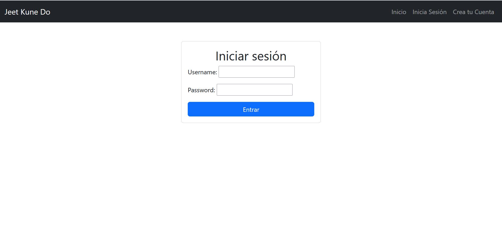
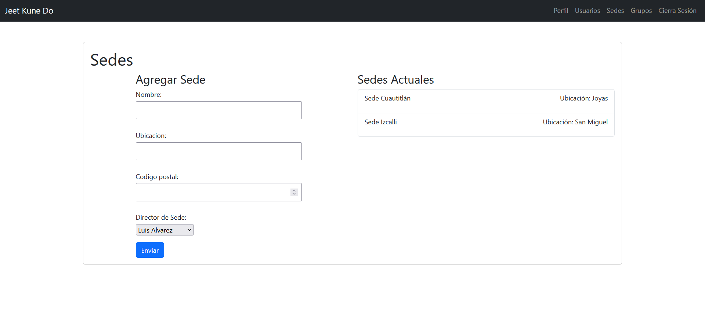

# Proyecto Jeet Kune Do
Jeet Kune Do es un sistema de gestión desarrollado en Django para una escuela de artes marciales fictia. Proporciona diferentes niveles de acceso según el rol del usuario, como director, instructor, secretario y alumno. 
El sistema incluye operaciones básicas de CRUD (Crear, Leer, Actualizar, Eliminar) para usuarios, sedes y clases.




## Instalación

Para instalar y ejecutar este proyecto localmente, sigue estos pasos:

1. Clona este repositorio en tu máquina local.
   ```bash
   git clone https://github.com/AxelCorreaL/Proyecto-Jeet-Kune-Do
   ```

2. Navega al directorio del proyecto.
   ```bash
   cd Proyecto-Jeet-Kune-Do
   ```

3. Instala las dependencias utilizando pip.
   ```bash
   pip install -r requirements.txt
   ```

4. Realiza las migraciones de la base de datos.
   ```bash
   python manage.py migrate
   ```

5. Crea un superusuario para acceder al panel de administración.
   ```bash
   python manage.py createsuperuser
   ```

6. Inicia el servidor de desarrollo.
   ```bash
   python manage.py runserver
   ```

7. Accede al sistema a través de tu navegador web en [http://localhost:8000](http://localhost:8000).

## Uso

Una vez que el servidor esté en funcionamiento, puedes acceder al sistema utilizando las credenciales del superusuario que creaste en el paso 5. Desde el panel de administración, podrás gestionar usuarios, planteles y clases según los permisos de tu rol.

## Contribución

Actualmente, no se aceptan contribuciones externas para este proyecto.

## Estado del Proyecto

Este proyecto escolar se considera completo y no se están realizando cambios activos en él.

## Licencia

Este proyecto se distribuye bajo las licencias de Django y Bootstrap. Consulta los archivos de licencia de cada proyecto para obtener más detalles.
